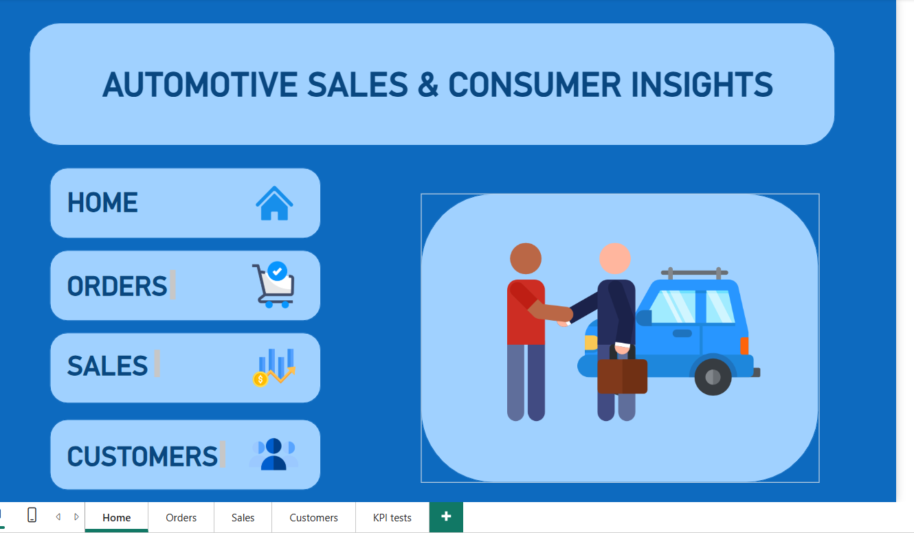
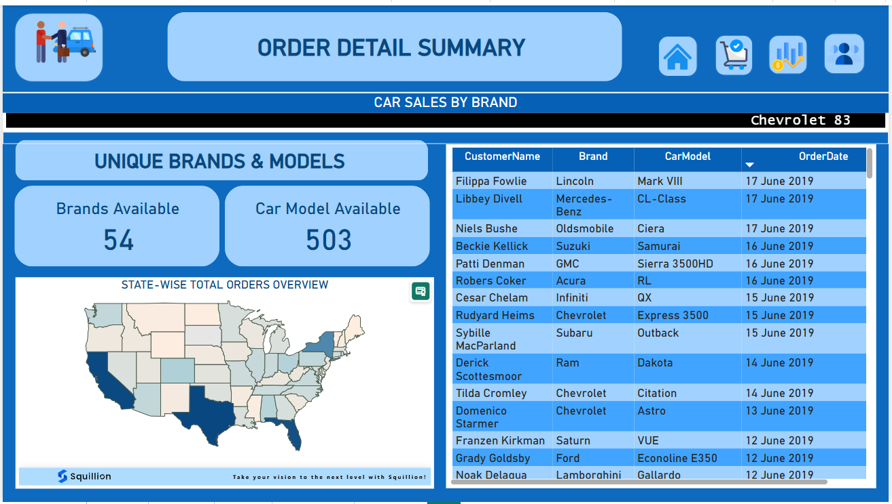
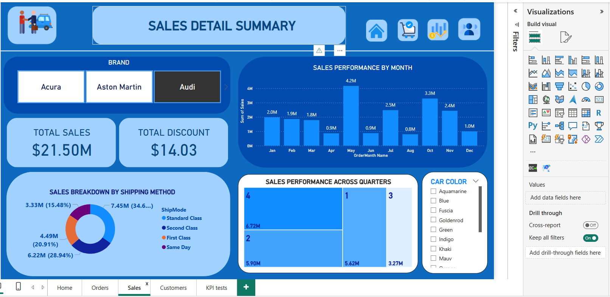
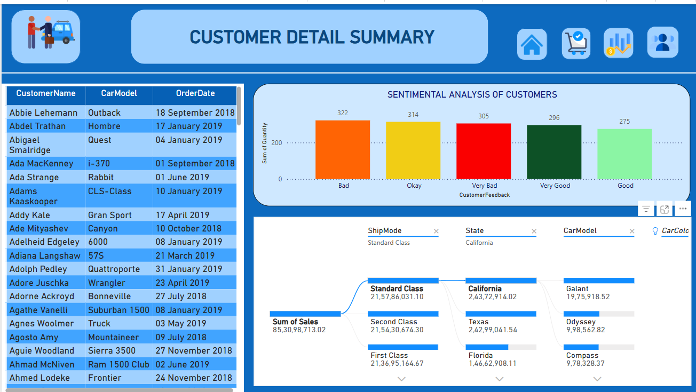
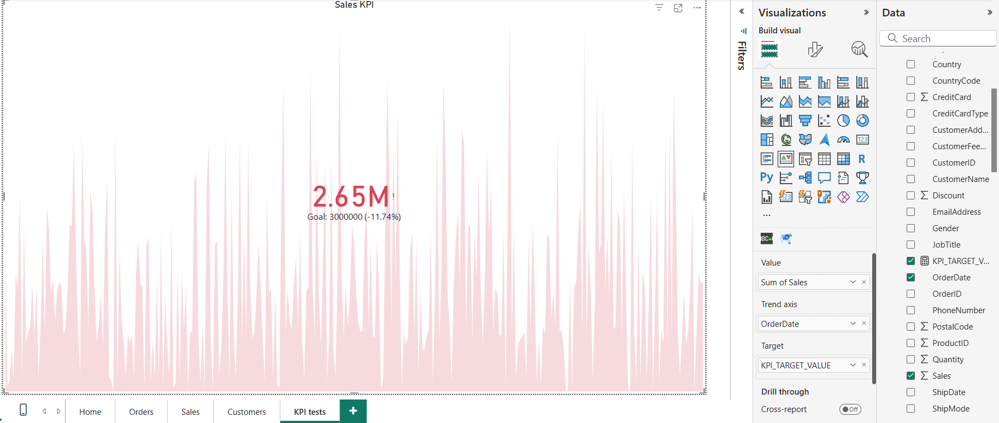

# Automotive-Sales-Consumer-Insights-Power-BI-Project

## Overview

This Power BI project provides a comprehensive analysis of automotive sales and consumer behavior. It includes interactive dashboards to visualize sales performance, order details, customer insights, and key performance indicators (KPIs). The project leverages data from various sources to offer actionable insights for stakeholders in the automotive industry.

## Project Structure

The project is organized into multiple pages, each focusing on a specific aspect of the data. Navigation between pages is facilitated through buttons (Home, Orders, Sales, Customers, KPI Tests) located on the left sidebar. Additional visuals such as scrollers and maps by Squillion enhance the interactivity and depth of the analysis.

## Pages Description

### 1. Home Page

**Purpose:**  
Serves as the landing page, providing an overview and navigation hub for the project.

**Content:**
- **Title:** *"Automotive Sales & Consumer Insights"* introduces the project's theme.
- **Navigation Buttons:** Features "HOME," "ORDERS," "SALES," "CUSTOMERS," and "KPI Tests" buttons with icons (house, shopping cart, sales chart, user profile, KPI indicator) for seamless navigation to respective dashboards.
- **Central Visual:** Displays a graphic of a customer and salesperson shaking hands next to a car, symbolizing the sales and consumer engagement focus.
- **Tab Bar:** Shows the current page ("Home") with options to switch to "Orders," "Sales," "Customers," or "KPI Tests," and a "+" button for adding new pages or visuals.

**Image:**  

---

### 2. Order Detail Summary

**Purpose:**  
Displays a detailed summary of car orders.

**Content:**
- **Unique Brands & Models:** Highlights the total number of unique brands (54) and car models (503) available.
- **Car Sales by Brand:** Shows sales data with Chevrolet leading at 83 units, followed by a table of customer names, brands, car models, and order dates (e.g., *Flippa Fowlie - Lincoln Mark VIII on 17 June 2019*).
- **State-wise Total Orders Overview:** Features a U.S. map visualizing order distribution, with states like California and Texas showing higher activity.

**Image:**  

---

### 3. Sales Detail Summary

**Purpose:**  
Provides an in-depth look at sales performance.

**Content:**
- **Total Sales & Discount:** Displays total sales ($21.50M) and total discount ($14.03M).
- **Sales Breakdown by Shipping Method:** A pie chart breaks down sales by shipping methods (e.g., *Standard Class 28.94%, Second Class 34.6%, First Class 20.91%, Same Day 15.48%*).
- **Sales Performance by Month:** A bar chart tracks monthly sales trends.
- **Sales Performance Across Quarters:** A heatmap shows quarterly sales distribution.
- **Car Color:** A filterable visual for analyzing sales by car color (e.g., *Aquamarine, Blue, Gold*).

**Image:**  

---

### 4. Customer Detail Summary

**Purpose:**  
Offers insights into customer behavior and sentiment.

**Content:**
- **Customer Data:** A table listing customer names, car models, and order dates (e.g., *Abbie Lehemann - Outback on 18 September 2018*).
- **Sentimental Analysis of Customers:** A bar chart categorizing customer feedback into *Bad (322), Okay (314), Hey Bad (305), Very Good (296), and Good (275)*.
- **Sales by Shipping Mode and State:** A line chart correlating shipping modes (Standard Class, Second Class, First Class) with states (e.g., *California, Texas, Florida*) and their sales figures.

**Image:**  

---

### 5. KPI Tests

**Purpose:**  
Monitors key performance indicators for sales targets.

**Content:**
- **Sales KPI:** A line graph tracking sales over time, with a current value of **$2.65M** against a goal of **$3.00M** (**-11.74% variance**).

**Image:**  

---

## Additional Visuals

- **Scroller:** Used to navigate through large datasets or detailed breakdowns within each page.
- **Map by Squillion:** Enhances the state-wise order overview with interactive geographic visualization.

---

## Data Sources

The project integrates data from:

- **cars_data:** Contains car maker, model, price, country code, customer address, discount feedback, and feedback order.
- **DateMaster:** Includes order date, month name, order month name, order quarter number, and DAX quarter.
- **DAX Measures:** Defines calculated measures like total sales.
- **Car_SupplyChainManagement:** Includes car maker, model, year, price, city, country code, and credit card details.

---
